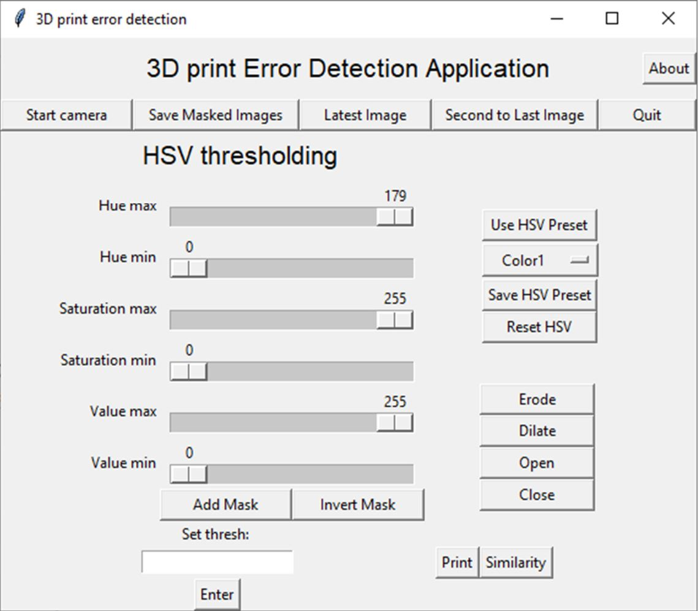

# Errordetector

Errordetector is an application for detecting errors in 3d printing using computer vision.
This project started out as a bachelor thesis in automation:
https://ntnuopen.ntnu.no/ntnu-xmlui/handle/11250/2656788

The process of 3D printing has become more available to the public, due to the increase of
affordable consumer FDM printers on the market. This process is however not without errors.
Most consumer printers do not have any way of detecting errors and will continue its
instructions regardless of the physical result. Errors usually results in waste of materials,
energy and time. The process of 3D printing objects can take anywhere from 10 minutes to
several days. It is therefore tedious for the user to monitor the whole process to detect errors.
This paper presents the development of a system for error detection in 3D printing using
computer vision. The system uses a raspberry pi, with camera to visually track and monitor
the objects printed. This system utilizes image analysis to monitor in real time the process of
3D printing objects. The system detects and alerts errors of filament runout and vertical shift
of the object.
The error detection compares consecutive images of each layer the printer builds. Key points
in the object is tracked and compared with key points in previous images to determine if an
error is present. Results from testing the system shows detection of common errors and
handling of false detection.
The result of this paper is a system that uses computer vision to detect errors in 3D printing.

## NB!
This is a working progress.
